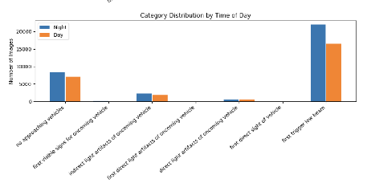
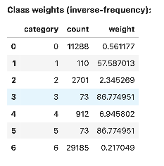
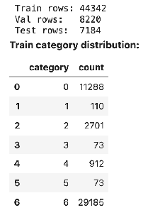
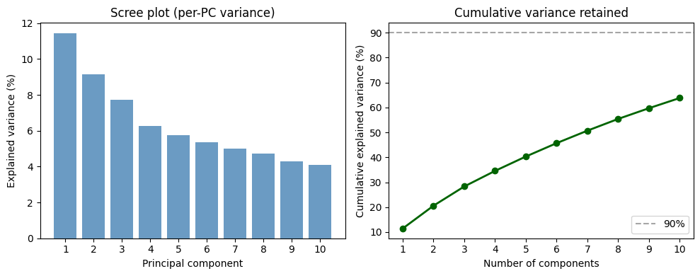
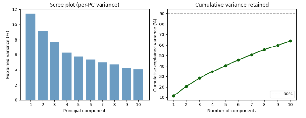

# 232R Group Project - Provident Vehicle Detection at Night (PVDN)

**Dataset:** [Provident Vehicle Detection at Night (PVDN)](https://www.kaggle.com/datasets/saralajew/provident-vehicle-detection-at-night-pvdn/data)

**Goal:** Preprocessing and modeling on PVDN using Apache Spark on SDSC Expanse: data load, feature engineering, PCA dimensionality reduction, and RandomForest classification (reflection label) with evaluation, explained variance, fitting analysis, and test-set prediction analysis.

**Branch for this work:** `Milestone4`

---

## Group Project Part 4: Final Submission

### I. Introduction

For this project, we chose the **Provident Vehicle Detection at Night (PVDN)** dataset from Kaggle. This dataset contains 59,746 greyscale images of low light and low visibility conditions. In these conditions, humans use cues such as light reflection to perceive oncoming vehicles and objects in the road. The goal within this project is to train a machine learning model in a similar manner to predict vehicle visibility through light reflection. Our group deemed this project of high importance because the automotive industry is shifting toward electric vehicles, with algorithms built to prepare for these exact scenarios. To gain an understanding of the technology that is engrained in our society, we chose to understand these algorithms through access to proper big data systems and machine learning. A strong model in this context can be defined as one that can properly identify objects in the road from light reflections, that does not overfit to our training data, and is easily adapted to future data of varying conditions.

To achieve proper results, **distributed computing through Spark** is essential. Not only did this dataset contain over fifty thousand images, each image required parallel parsing through metadata, ultimately leading to our main dataframe with over fifty-four thousand rows with columns that were feature-engineered through formulas calculated on each row. Multiple dataframes were parsed and merged together through joins to ensure a cohesive dataset sufficient to assemble as a vector. This vector is preprocessed and input to a Random Forest with hundreds of trees, along with principal component analysis of these vectors. Through this pipeline of aggregations, joins, vectorizations, and parallel computing, the necessity of Spark for scalability and computation becomes clear.

### II. Methods

**Data exploration**

The first step was to understand how our data behaves through exploratory analysis. We loaded the image data and confirmed the count at ~59k images. We printed the schema to see feature types and the JSON structure. We explored the distribution of the dataset—in particular class imbalance, vehicle stages, and rarity of mid stages. For example, in **Figure 1**, we see a high concentration of one category (first trigger low beam) compared to other categories.



Exploratory distribution analysis is critical because Random Forest depends on the structure and balance of the dataset when determining model behavior.

**Preprocessing**

All preprocessing was executed within **Spark DataFrames** to maintain compatibility with distributed HPC execution on **SDSC Expanse**. Because the project involves image-based data, image dimensions were standardized to a fixed resolution, with pixels normalized from [0, 255] to [0, 1]. We dropped rows where critical identifiers are missing (e.g., `image_id`, `annotation_id`). Where optional metadata was missing, we coded a separate category labeled “unknown,” and numeric values were handled with `fillna()`. To address class imbalance, **class-weight sampling** was used to reduce overfitting.

**Model 1: Random Forest (RF1 and RF2)**

We split the data into **44,342** training rows and **7,184** test rows. Class weights were fit by category (**Figures 2–3** in the write-up).



The task was **binary classification**: predicting whether an image contained a vehicle. Using MLlib `RandomForestClassifier`, two models were trained on the feature vector:

- **RF1:** 200 trees, max depth 8  
- **RF2:** 500 trees, max depth 16  

**Model 2: PCA + Random Forest**

We used **Principal Component Analysis** after a train/test split (**Figure 4**). Preprocessing included missing-value imputation, categorical encoding, vector creation, and scaling. The vector was passed through PCA with **k = 10** components. A binary label indicated whether at least one vehicle is present. The Random Forest classifier used PCA-reduced features.



**Explained variance (PCA)** — scree and cumulative variance from [`milestone_4.ipynb`](milestone_4.ipynb):



### III. Results

**Model 1 (RF1 / RF2)** and **Model 2 (RF + PCA):** metrics and confusion-style summaries (**Figures 5–8** in the report) are shown below (single composite figure from the notebook export).



Source artifact: [`milestone_4.ipynb`](milestone_4.ipynb) (run outputs).

### IV. Discussion

Going into this project, our team put an emphasis on exploratory data analysis. When building a Random Forest Model, it is essential to have an understanding of how data is imbalanced at such a large scale for feature engineering and parameter tuning of machine learning models. 
For our first model, our group chose to run two different random forests, with slightly different parameters, in efforts to optimize our results. As seen by our results in figure 5, RF1 performed best in terms of performance. This outcome was a surprise, as we initially believed that a higher number of trees and max depth as seen in R2, would lead to better performance. We defined “better performance” as a  model with better generalization, lower variance, and consistent F1 across all splits. Although R2 has a higher training accuracy, it did not meet the criteria of what we consider to be the best model, making R1 our model of choice. Ultimately, we want a model that will not overfit to new data, and R2 was more susceptible to this. Our next model of choice was PCA with random forest. This model showed more overfitting, leading us to the conclusion that dimensionality reduction does not always improve predictive performance. It is clear that important relationships of features were not properly preserved after dimensionality reduction. It is possible that adding more components could help retain more variance in future testing. 

### V. Conclusion

In conclusion, we learned the importance and necessity of big data processing to solve large scale data problems. This prediction task and other real world scenarios require heavy training data, preprocessing, and tuning that can only be done through tools like Spark. Distributing computing changed our approach by allowing us to use the entire data set, joins on multiple dataframes, and feature engineering on one aggregate data set. This process removed the limitation of local machine resources, allowing us to get the most out of our machine learning models. With more time and resources, we would explore more models, as well as more hyper parameter tuning on models we did choose, to see if we could improve performance even further. We were hopeful that PCA would give better results, so perhaps trying different dimensions, or at least understanding exactly why this model failed us, and how it can be improved in the future. 

### V. Statements of Collaboration

Julian Estrada: I formed the github repository and chose the data set. While I was actively in communication with my team, others took the lead on most of the code. However I did add to the EDA section, and helped in building our first random forest model.  I attended all meetings and ensured I did what I could to help out when needed. When it came time for milestone 4, I wrote the entire written report section, with feedback and refinements from my group members. 

Shaily Nieves Adame: Overall, we all worked well as a team. Did our best to complete assignments before the due date. We consistently made time in between assignments to meet and discuss how we could approach each milestone. Each member in this group maintained an active role throughout the semester. My personal role in this project was the following: Shared ideas and researched potential ideas for the project and performed an EDA on half of the data set to have a broad idea on potential models. I wrote the code for the milestone 3 model and completed the write-up. For Milestone 4, I mainly focused on the write up for fitting analysis and conclusion along with partial code for prediction analysis on github. I will say, Ryan Liao was quick to become the group leader. He made sure the final assignment submissions  for each milestone were completely polished. He was willing to give constructive feedback on code. 

Ryan Liao: I managed the Github repository by organizing the branches and formatting the markdowns. I was the main contributor for the data cleaning and modeling, coming up with the main pre-processing strategies and model choice/approach. I always wanted to be ahead of schedule, since I wanted to avoid the Expanse bottlenecks becoming a big issue for us. I also had a hand in reviewing all of the submitted artifacts, as I was the one submitting usually.


---

## Notebooks & code

| Artifact | Description |
|----------|-------------|
| [milestone_4.ipynb](milestone_4.ipynb) | Main notebook: data load, preprocessing, PCA (k=10) + RandomForest, train/val/test evaluation, explained variance (scree + cumulative), fitting analysis, conclusion, and test-set predictions (correct / FP / FN). |

All code and notebooks are in the repo; the link above points to the M4 notebook. Commit and push the `Milestone4` branch so the link resolves (e.g. on GitHub).

---

## Running on SDSC Expanse

### 1. First-time setup (run once after login)

```bash
ln -sf /expanse/lustre/projects/uci157/$USER
ln -sf /expanse/lustre/projects/uci157/esolares
```

### 2. Fetch the repo and checkout Milestone 4

```bash
cd 232R-group-project
git fetch origin Milestone4
git checkout Milestone4
```

### 3. Submit a job

The SLURM script `run_pvdn_eda.sh` is pre-configured with the correct account, partition, cores, and memory. Run:

```bash
sbatch run_pvdn_eda.sh
```

| SLURM Setting | Value            |
|---------------|------------------|
| Account       | `TG-SEE260003`   |
| Partition     | `debug`          |
| Cores         | 8                |
| Memory        | 128 GB           |
| Wall Time     | 30 min           |
| Output        | `logs/pvdn_<jobid>.out` |

Then run [milestone_4.ipynb](milestone_4.ipynb) on Expanse (e.g. Jupyter in an interactive job or a job that runs the notebook). The notebook writes outputs under `_m4_outputs`.

---

## SDSC Expanse environment

### Cluster resources

Spark jobs use a single compute node on [SDSC Expanse](https://www.sdsc.edu/services/hpc/expanse/):

| Resource    | Value   |
|-------------|---------|
| Total Cores | 8       |
| Total Memory| 128 GB  |
| Partition   | shared  |

### SparkSession configuration

```python
spark = SparkSession.builder \
    .config("spark.driver.memory", "2g") \
    .config("spark.executor.memory", "18g") \
    .config("spark.executor.instances", 7) \
    .getOrCreate()
```

One core is reserved for the driver; the remaining 7 run executors. Executor memory is (128 GB − 2 GB) / 7 ≈ 18 GB per executor.

### Data location on Expanse

```
DATA_ROOT = /expanse/lustre/projects/uci157/kkravchenko/provident-vehicle-detection-at-night-pvdn
```

PVDN lives on Lustre for high-throughput I/O during Spark reads.
